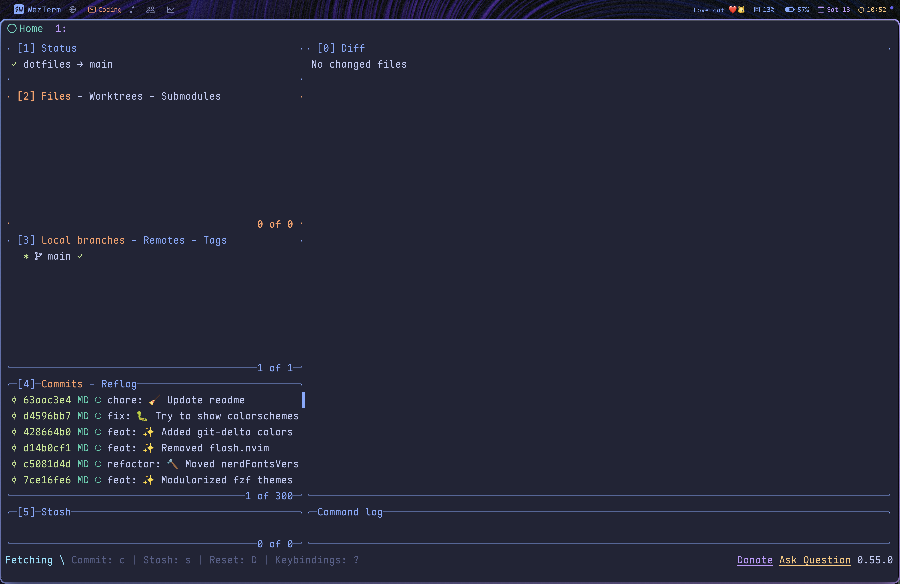
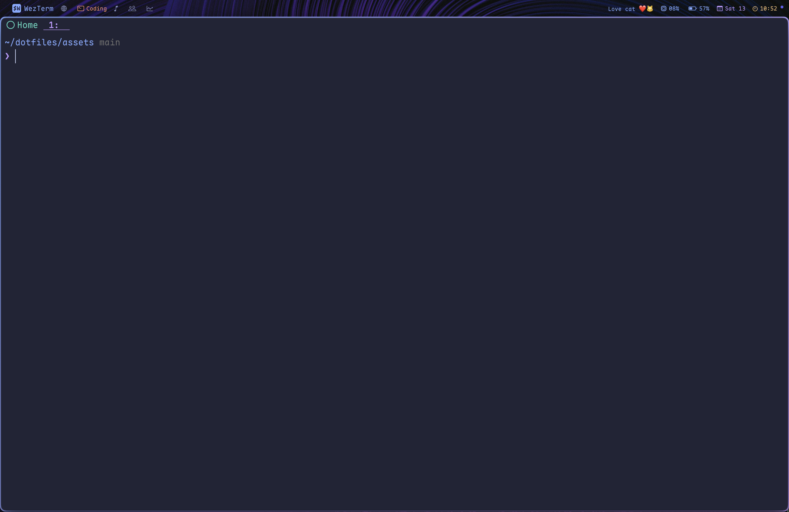

# My dotfiles (for MacOS)

<!--toc:start-->
- [My dotfiles (for MacOS)](#my-dotfiles-for-macos)
  - [Features](#features)
  - [Prerequisites](#prerequisites)
  - [Install Instructions](#install-instructions)
  - [Post-install](#post-install)
    - [Zen](#zen)
    - [LeaderKey](#leaderkey)
  - [Screenshots](#screenshots)
<!--toc:end-->

## Features

- Omarchy-like flexible shell-script-based actions for common commands
- Omarchy-like theme switching

## Prerequisites

- curl (Comes with macos by default)

## Install Instructions

``` bash
curl -fsSL https://raw.githubusercontent.com/matt-dong-123/dotfiles/refs/heads/main/install.sh
chmod +x install.sh
./install.sh
```

Paste this into your terminal, and follow the steps of the install
script.

## Post-install

### Zen

1. Install the following addons:
    - Brave Search: Private Search Engine
    - Vimium C
    - Dark Reader
    - Return YouTube Dislike
    - SponsorBlock
    - Zen Internet
    - Stylus
2. Navigate to about:config, set browser.tabs.allow_transparent_browser to true
3. Install [Sine mods](https://github.com/CosmoCreeper/Sine)
4. For each of the extensions given, find the "Import" or "Restore"
    button, and choose the corresponding file in ~/.config/zen
5. Copy the user.js in ~/.config/zen to your profile directory
6. Delete the user.js after starting the browser (settings will be
    remembered automatically)
7. Disable loading animation in Nebula settings

### LeaderKey

1. Go to the LeaderKey settings and go to the "Advanced" tab
2. Set the config directory to your ~/.config/leaderkey directory
3. Go back to "General" and set the shortcut to be "f13" by tapping the
    right command key

## Screenshots






