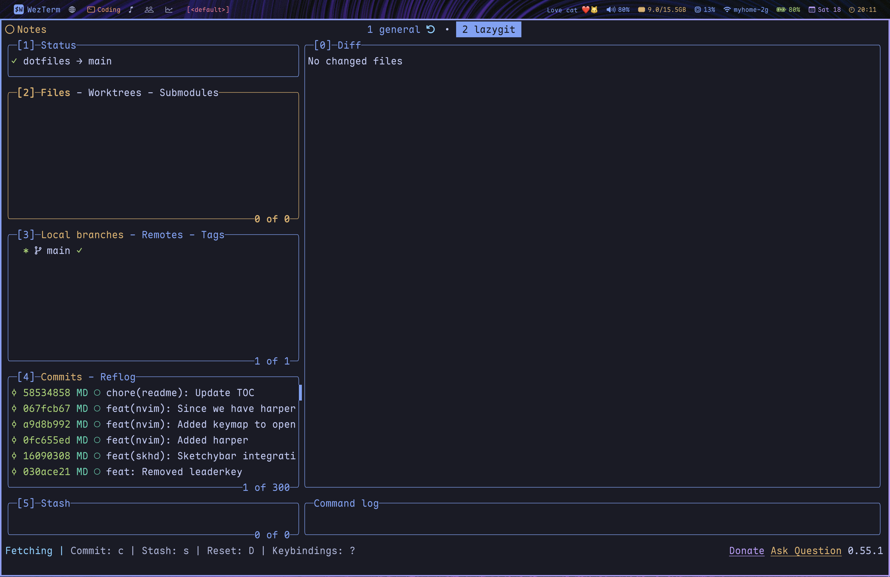
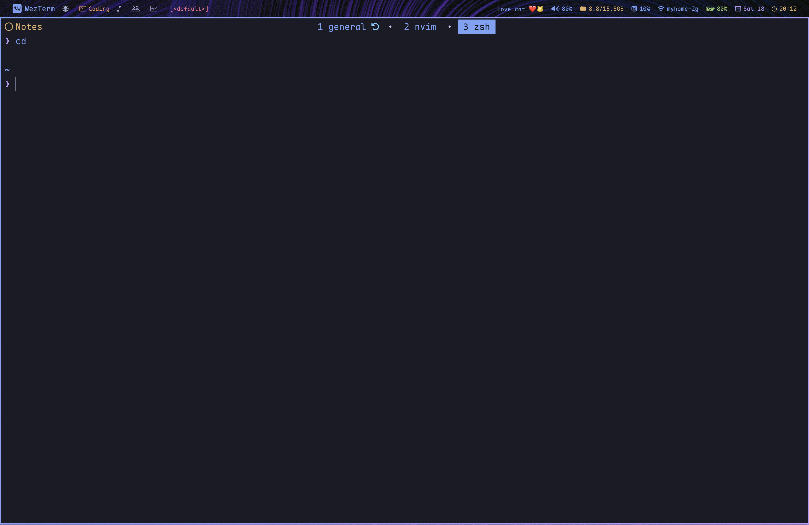

 ```
 ██████╗ ███╗   ███╗ █████╗  ██████╗ █████╗ ███████╗███████╗
██╔═══██╗████╗ ████║██╔══██╗██╔════╝██╔══██╗██╔════╝██╔════╝
██║   ██║██╔████╔██║███████║██║     ███████║███████╗█████╗
██║   ██║██║╚██╔╝██║██╔══██║██║     ██╔══██║╚════██║██╔══╝
╚██████╔╝██║ ╚═╝ ██║██║  ██║╚██████╗██║  ██║███████║███████╗
 ╚═════╝ ╚═╝     ╚═╝╚═╝  ╚═╝ ╚═════╝╚═╝  ╚═╝╚══════╝╚══════╝
```

In other words, my dotfiles.

<!--toc:start-->
- [Features](#features)
- [Prerequisites](#prerequisites)
- [Install Instructions](#install-instructions)
- [Post-install](#post-install)
  - [Zen](#zen)
- [Screenshots](#screenshots)
<!--toc:end-->

## Features

- Pure enjoyment and efficiency
- Theme-switching and menu system (Like omarchy!)

## Prerequisites

- MacOS 15 or later

## Install Instructions

``` bash
curl -fsSL https://raw.githubusercontent.com/matt-dong-123/dotfiles/refs/heads/main/install.sh
chmod +x install.sh
./install.sh
```

Paste this into your terminal, and follow the steps of the install
script.

## Post-install

### Zen

1. Install the following addons:
    - Brave Search: Private Search Engine
    - Vimium C
    - Dark Reader
    - Return YouTube Dislike
    - SponsorBlock
    - Zen Internet
    - Stylus
    - Auto Tab Discard
2. For each of the extensions given, find the "Import" or "Restore"
    button, and choose the corresponding file in ~/.config/zen
3. Copy the user.js in ~/.config/zen to your profile directory
4. Delete the user.js after starting the browser (settings will be
    remembered automatically)

## Screenshots






