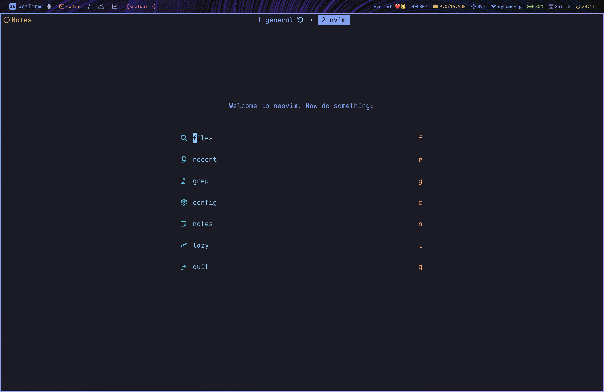
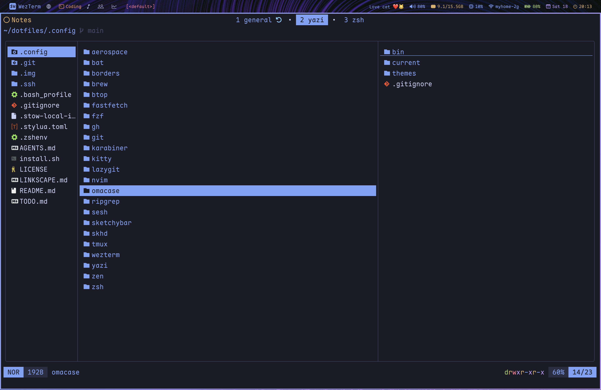

```

    ███████    ██████   ██████   █████████     █████████    █████████    █████████  ██████████
  ███░░░░░███ ░░██████ ██████   ███░░░░░███   ███░░░░░███  ███░░░░░███  ███░░░░░███░░███░░░░░█
 ███     ░░███ ░███░█████░███  ░███    ░███  ███     ░░░  ░███    ░███ ░███    ░░░  ░███  █ ░ 
░███      ░███ ░███░░███ ░███  ░███████████ ░███          ░███████████ ░░█████████  ░██████   
░███      ░███ ░███ ░░░  ░███  ░███░░░░░███ ░███          ░███░░░░░███  ░░░░░░░░███ ░███░░█   
░░███     ███  ░███      ░███  ░███    ░███ ░░███     ███ ░███    ░███  ███    ░███ ░███ ░   █
 ░░░███████░   █████     █████ █████   █████ ░░█████████  █████   █████░░█████████  ██████████
   ░░░░░░░    ░░░░░     ░░░░░ ░░░░░   ░░░░░   ░░░░░░░░░  ░░░░░   ░░░░░  ░░░░░░░░░  ░░░░░░░░░░ 
```

In other words, my dotfiles.

<!--toc:start-->
- [Features](#features)
- [Software Included](#software-included)
- [Prerequisites](#prerequisites)
- [Install Instructions](#install-instructions)
- [Post-install](#post-install)
  - [Zen](#zen)
- [Screenshots](#screenshots)
<!--toc:end-->

## Features

- Pure enjoyment and efficiency
- Theme-switching and menu system (Like Omarchy!)

## Software Included

- Editor: [Neovim](https://neovim.io)
- Bar: [SketchyBar](https://felixkratz.github.io/SketchyBar)
- Browser: [Zen Browser](https://zen-browser.app) and [Helium Browser](https://helium.computer)
- Terminal Emulator: [WezTerm](https://wezterm.org), and [Kitty](https://sw.kovidgoyal.net/kitty) for menus
- Music Player: [kew](https://codeberg.org/ravachol/kew)
- Git UI: [lazygit](https://github.com/jesseduffield/lazygit)
- Fuzzy Picker: [fzf](https://junegunn.github.io/fzf)
- File Manager: [yazi](https://yazi-rs.github.io)
- Package Manager: [HomeBrew](https://brew.sh)
- Window Manager: [AeroSpace](https://nikitabobko.github.io/AeroSpace/guide)
- Keyboard Manager(s): [Karabiner Elements](karabiner-elements.pqrs.org) and [skhd.zig](github.com/jackielii/skhd.zig)
- AI CLI: [opencode](https://opencode.ai)
- Prompt: [starship](https://starship.rs)
- Shell: [zsh](https://github.com/zsh-users/zsh) and [zgenom](github.com/jandamm/zgenom)
- Terminal multiplexer and manager: [tmux](https://github.com/tmux/tmux) and [sesh](github.com/joshmedeski/sesh)
- Eye candy around windows: [JankyBorders](https://github.com/FelixKratz/JankyBorders)

## Prerequisites

- MacOS 15 or later

## Install Instructions

``` bash
curl -fsSL https://raw.githubusercontent.com/matt-dong-123/dotfiles/refs/heads/main/install.sh
chmod +x install.sh
./install.sh
```

Paste this into your terminal, and follow the steps of the install
script.

## Post-install

> [!important]
> Click on System Settings > Displays > More Space
> This setup wouldn't work otherwise

### Zen

1. Install the following addons:
    - Brave Search: Private Search Engine
    - Vimium C
    - Dark Reader
    - Return YouTube Dislike
    - SponsorBlock
    - Zen Internet
    - Stylus
    - Auto Tab Discard
2. For each of the extensions given, find the "Import" or "Restore"
    button, and choose the corresponding file in ~/.config/zen
3. Copy the user.js in ~/.config/zen to your profile directory
4. Delete the user.js after starting the browser (settings will be
    remembered automatically)

## Screenshots







