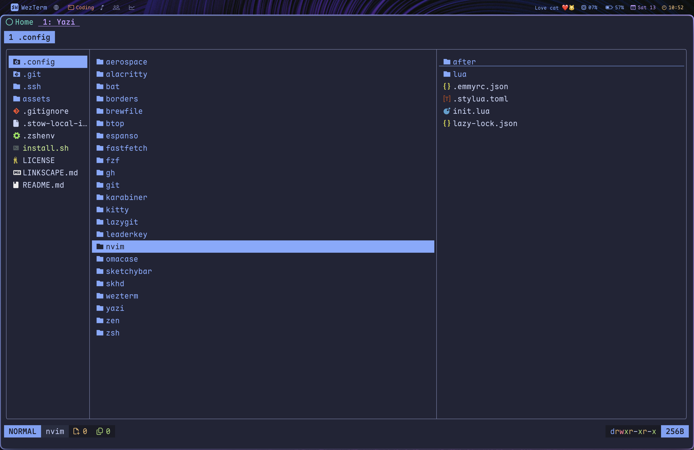

# My dotfiles (for MacOS)
<!--toc:start-->
- [My dotfiles (for MacOS)](#my-dotfiles-for-macos)
  - [Prerequisites](#prerequisites)
  - [Install Instructions](#install-instructions)
  - [Post-install](#post-install)
    - [Zen](#zen)
    - [LeaderKey](#leaderkey)
  - [Screenshots](#screenshots)
<!--toc:end-->
## Prerequisites

> [!warning]
> Only MacOS Sequoia is tested. Not sure about how this would
> behave on a beta or an older system. However, some components of this
> config (e.g. nvim) will work on any system.

- You pretty much don't need anything except curl.

## Install Instructions

``` bash
curl -fsSL https://raw.githubusercontent.com/matt-dong-123/dotfiles/refs/heads/main/install.sh
chmod +x install.sh
./install.sh
```

Paste this into your terminal, and follow the steps of the install
script.

## Post-install

### Zen

1.  Install the following addons:
    - Brave Search: Private Search Engine
    - Vimium C
    - Dark Reader
    - Return YouTube Dislike
    - DeArrow
    - SponsorBlock
    - Zen Internet
    - Stylus
2.  Install [Sine mods](https://github.com/CosmoCreeper/Sine)
3.  For each of the extensions given, find the "Import" or "Restore"
    button, and choose the corresponding file in ~/.config/zen
4.  Copy the user.js in ~/.config/zen to your profile directory
5.  Delete the user.js after starting the browser (settings will be
    remembered automatically)
6.  Disable loading animation in Nebula settings

### LeaderKey

1.  Go to the LeaderKey settings and go to the "Advanced" tab
2.  Set the config directory to your ~/.config/leaderkey directory
3.  Go back to "General" and set the shortcut to be "f13" by tapping the
    right command key

## Screenshots

<figure>

<figcaption>Wezterm</figcaption>
</figure>

<figure>

<figcaption>Lazygit</figcaption>
</figure>

<figure>

<figcaption>Neovim</figcaption>
</figure>

<figure>

<figcaption>Yazi</figcaption>
</figure>

<figure>

<figcaption>Zen Browser</figcaption>
</figure>
